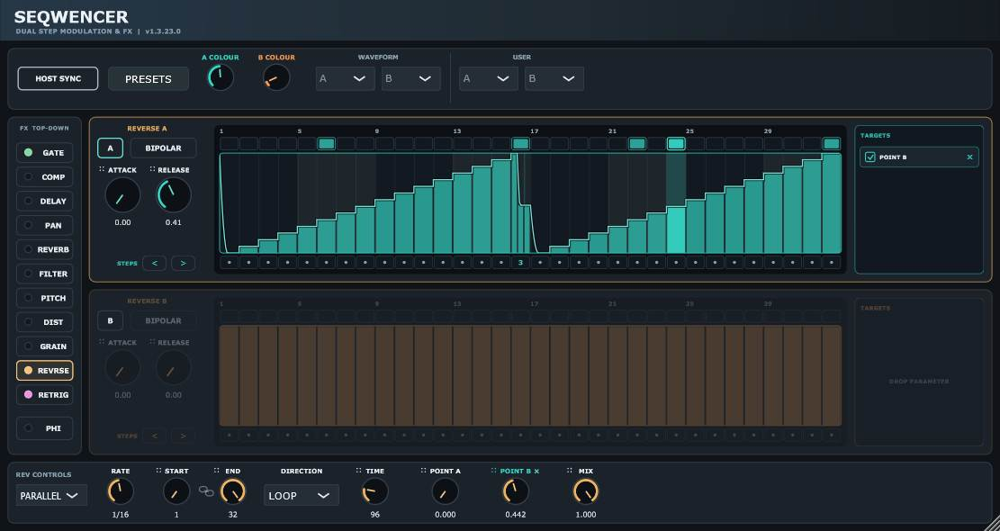

# Seqwencer
## Coming soon...

Seqwencer is a dual sequencer plugin with ease of use and flexibility in mind. You can use it on its own as a plugin in a DAW, where the built in FX can be sequenced individually, just drag any parameter starting with :: to the relevant target panel. Draw your sequence using the mouse, just click and drag. Several FX are built into the sequencer:
- Gate / Noise gate
- Filter: Cutoff / Resonance
- Pitch
- Pan
- Grainshifter
- Delay
- Reverb

But, unlike other sequencers of this type, it can be integrated with my PolyHostInterface plugin and control any parameter of any other plugin loaded into PHI. You can load an arp, your own choice of delay, reverb, filter, or any synth, and as long as that plugin reveals its parameters, it can be controlled by Seqwencer's step sequencers, either in Parallel or Serial mode as well as unipolar or bipolar. Basically, this means you can modulate ANYTHING! PHI has been upgraded to allow this symbiant functionality. Take a look at the new PHI Macro Mappings to see how much easier this is to control both as if they were one plugin. Possibly a first of its kind maybe?
